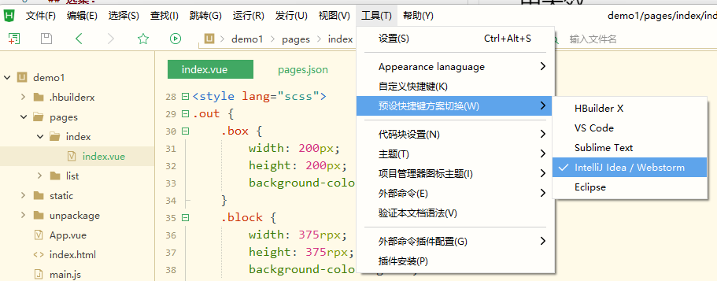

# 问题1：无法启动微信小程序开发者工具预览
## 问题描述
HBuilderX中报错：

启动微信小程序开发者工具
## 选集：
P3
## 解决方法：
打开微信小程序开发者工具的**服务端口**，以便HBuilderX能够启动它：

# 问题2：传统html标签如h1、i等在小程序中失效
## 选集：
P4
## 解决方法：
传统html标签只适合开发h5应用，如微信公众号程序，如果要让h5应用和小程序应用效果一致，应当使用uniapp提供的组件开发。

# 问题3：相对像素单位rpx的满屏宽度是多少？
## 选集：
P6
## 解决方法：
按照iphone6的宽度作为标准，即750

# 问题4：如何在Hbuilder X 中使用使用Webstorm的快捷键
## 解决方法：
如图操作：

